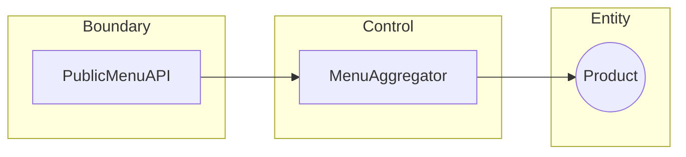

# Documentation Templates (Rexeat Standard)

> Estándares de documentación para el ecosistema Rexeat. Enfoque atómico, técnico y de alta precisión.

---

## 🏛️ 1. Estructura del Vault Atómico

Toda documentación interna en `docs/internal/` debe seguir esta jerarquía obligatoria:

- **00_Producto_y_Diseno/**: Visión, UX, Sistema de Diseño.
- **01_Arquitectura_y_Sistemas/**: Infraestructura, Modelos de Datos, APIs, Resiliencia.
- **02_Ingenieria_y_Desarrollo/**: DX, Estándares de Código, Testing, Monorepo.
- **03_Operaciones_y_Hardware/**: NFC, Onboarding de locales.
- **04_Negocio_y_Estrategia/**: Finanzas, GTM, Legal, Tracking.

---

## ⚖️ 2. Guía de Responsabilidad (Alérgenos)

Al documentar funciones de seguridad alimentaria, se DEBE usar un lenguaje que empodere al restaurante sin asumir su responsabilidad legal.

| ❌ Evitar (Culpabilizador/Defensivo) | ✅ Preferir (Soporte/Empoderamiento)         |
| ------------------------------------ | -------------------------------------------- |
| "Rexeat no es responsable de..."     | "Rexeat dota al local de una herramienta..." |
| "La culpa es del restaurante..."     | "La validación final es del profesional..."  |
| "IA prohibida por errores..."        | "Salvaguarda técnica via control humano..."  |

---

## 🚀 3. Documentación de APIs (Edge-First)

Las APIs de Rexeat (Hono + Vercel Edge) deben documentarse con enfoque en el contrato y el aislamiento.

### Plantilla de Endpoint

```markdown
## [METODO] /ruta/endpoint

[Descripción breve del propósito]

**Estrategia de Aislamiento:** [Middleware utilizado, ej: withTenantRepo]

### Contrato (Zod)

- **Input:** `SchemaName` (Query/Body)
- **Output:** `ResponseSchemaName`

### Flujo de Datos

[Diagrama Mermaid simple si el flujo es complejo]
```

---

## 🌊 4. Modelado de Flujos y Robustez

Usar Mermaid para diagramas BCE (Boundary-Control-Entity) o Secuencia.

### Ejemplo BCE (Robustness)



---

## 🧩 5. Comentarios de Código (TSDoc)

Priorizar el "Por qué" sobre el "Qué".

```typescript
/**
 * Inyecta el repositorio de inquilino validando el orgId del JWT.
 *
 * @param c - Contexto de Hono
 * @param next - Función de continuación
 * @throws 401 - Si el orgId no está presente en el token
 */
```

---

## 🛠️ 6. Principios de Estructura

| Principio              | Aplicación                                                |
| ---------------------- | --------------------------------------------------------- |
| **Atomicidad**         | Un tema por archivo. Evitar documentos de >500 líneas.    |
| **Navegabilidad**      | Siempre incluir enlaces "Ver también" al final.           |
| **Referencia Cruzada** | Vincular a tipos de `@rexeat/types` cuando sea posible.   |
| **Verificabilidad**    | Las metas técnicas (ej: LCP < 1.2s) deben ser explícitas. |

---

> **Mandato AI:** Al crear nuevos documentos, verifica siempre la coherencia con el Portal Maestro en `docs/internal/README.md`.
